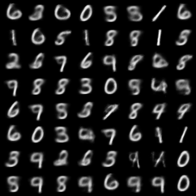
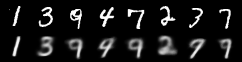
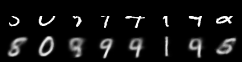
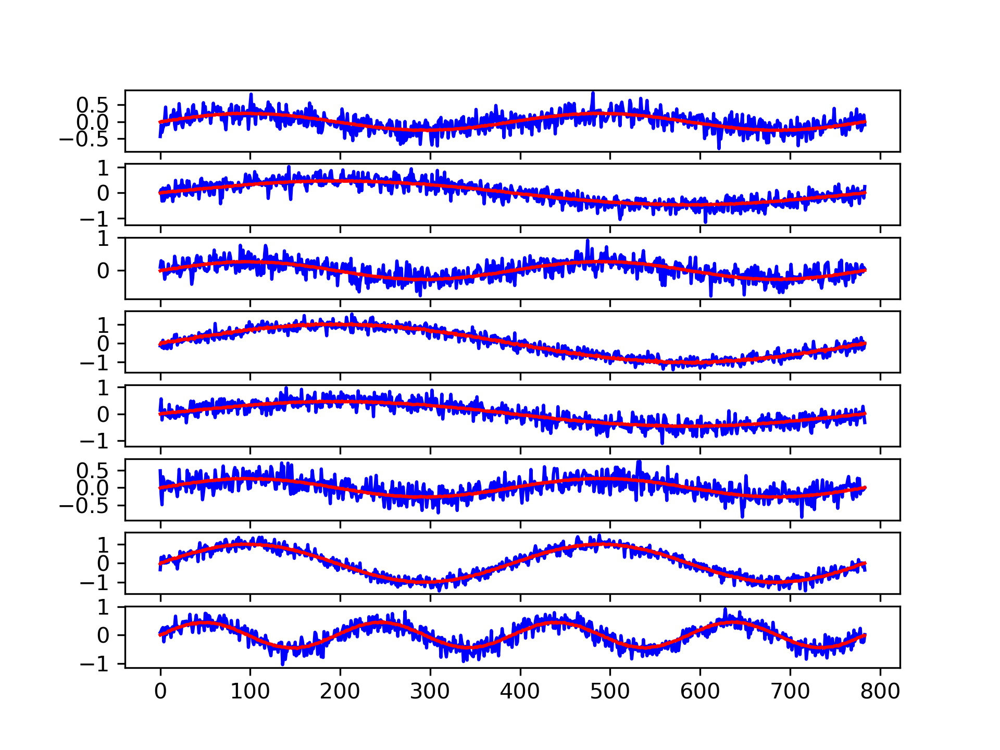
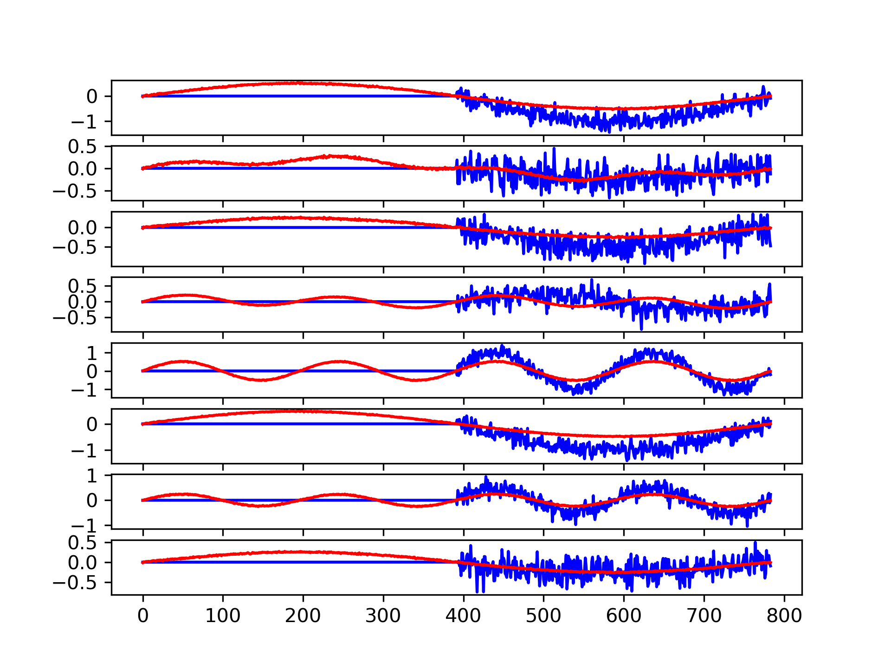

# Variation Autoencoder with Missing values

A Pytorch implelmentation of VAE for handling missing data in test. [Here](https://medium.com/@ebrahim.soroush/variational-auto-encoder-with-missing-data-b975abd0a9c?sk=70b58740c1e214b599ff1c1bc2707ae5) is my medium post.

## Requirements:
* [pytorch](http://pytorch.org/)
* numpy
* matplotlib
* tqdm


## How to run

This is a sample code to working with a VAE in pytorch in with missing data. There are two experiments with two datasets: MNIST and synthetic timeseries data. In the following you can find how to run each experiment.

### Running with MNIST
To train VAE:
```bash
python main.py --epochs 100 --train_mode mnist
```
To test with partial data:
```bash
python tests.py --test_partial_data_mnist
```


An example of sampling output:  
  

An example of reconstruction output:  


An example of reconstruction output with partial data:  


### Running with synthetic timeseries
First we need to generate synthetic data for both train and test data
```bash
python tests.py --generate_timeseries_synthetic_train
python tests.py --generate_timeseries_synthetic_test
```
And then train VAE model:
```bash
python main.py --epochs 100 --train_mode synthetic_timeserie
```
And finally test with partial data
```bash
python tessts.py --test_partial_data_synthetic_ts
```

An example of reconstruction:  


An example of reconstruction with partial data:

